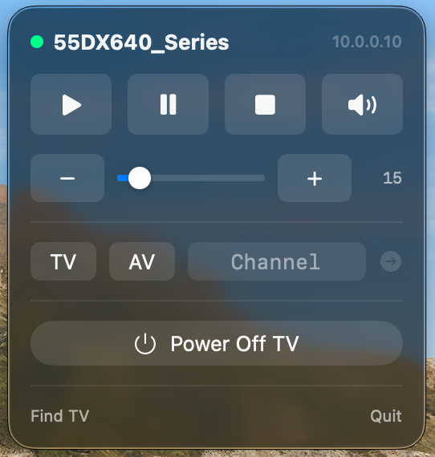

# mac-tv-menubar-remote

A native macOS menu bar remote for Panasonic VIERA TVs (unencrypted protocol, pre-2018 models such as the DX640 series). Play, pause, stop, mute, set volume, and power off the TV from a dropdown in the menu bar.

<p align="center">
  
</p>

## Features

- **Auto-discovery**: finds the TV via SSDP (`ssdp:all` M-SEARCH, filtered to the VIERA `/nrc/ddd.xml` descriptor), so it keeps working when the TV's IP changes. Last known address is cached for instant startup and re-discovery only happens when the TV stops answering.
- **±30s skip buttons for casting**: a built-in Google Cast v2 client (TLS on port 8009, protobuf-framed JSON, zero dependencies) sends `SEEK` to the Chromecast's live media session — the same command the Google Home app's skip buttons use. Works with Netflix and anything else that casts. Chromecasts are auto-discovered over the same SSDP broadcast.
- **Cast-aware play/pause**: routed straight to the Chromecast when a cast session is active, falling back to the TV remote key (HDMI-CEC hop) otherwise. The popover shows what's casting and its player state.
- **Absolute volume slider** backed by UPnP RenderingControl `GetVolume`/`SetVolume` (debounced), with live volume/mute state synced every time the popover opens.
- **Transport keys** (play/pause/stop) and power-off via Panasonic's `X_SendKey` SOAP action on port 55000.
- Ships as a proper `.app` with `LSUIElement` — menu bar only, no Dock icon.

## Download

Grab the latest build from [Releases](https://github.com/nuwanprabhath/mac-tv-menubar-remote/releases) — download the `.zip`, unzip it, and drag `TV Menubar Remote.app` into `/Applications`.

The app is ad-hoc signed (not notarized by Apple), so macOS Gatekeeper will refuse to open it with a plain double-click the first time. To run it: **right-click the app → Open → Open** in the dialog that follows. You only need to do this once.

## Build & install

```sh
./build.sh
open "dist/TV Menubar Remote.app"          # run it
cp -R "dist/TV Menubar Remote.app" /Applications/   # install
```

To start at login: System Settings → General → Login Items → add the app.

## CLI test flags

The same binary doubles as a network-layer test tool:

```sh
.build/release/MacTVRemote --discover              # list VIERA TVs and Cast devices on the LAN
.build/release/MacTVRemote --status [ip]           # print TV volume/mute state
.build/release/MacTVRemote --cast-status [ip]      # print the Chromecast's media session
.build/release/MacTVRemote --cast-seek <±s> [ip]   # seek the active cast session, e.g. --cast-seek 30
```

## Notes

- **Power on doesn't work** once the TV is fully off — the DX640 shuts down its network interface in standby (unless the TV's networked-standby setting is enabled). Power *off* works.
- macOS may show a **Local Network permission** prompt on first launch (needed for SSDP multicast and talking to the TV) — allow it.
- Protocol details: SOAP over HTTP to `http://<tv>:55000/nrc/control_0` (key presses, `urn:panasonic-com:service:p00NetworkControl:1#X_SendKey`) and `/dmr/control_0` (volume/mute, standard `RenderingControl:1`). No pairing or encryption is required on this model generation; 2018+ models would need the encrypted pairing handshake, which this app does not implement.
